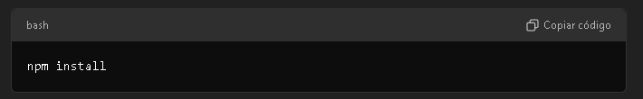
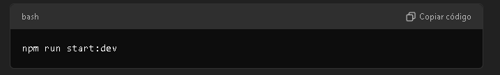

# Pokedex Pokemon

Este é um projeto de API backend para uma Pokedex de Pokémon, desenvolvido com o framework NestJS. Ele fornece uma estrutura básica para listar e gerenciar informações de diferentes Pokémon.

## Índice

- [Instalação](#instalação)
- [Scripts Disponíveis](#scripts-disponíveis)
- [Estrutura do Projeto](#estrutura-do-projeto)
- [Tecnologias Utilizadas](#tecnologias-utilizadas)
- [Testes](#testes)
- [Licença](#licença)

## Instalação

Para rodar este projeto localmente, siga os passos abaixo:

1. Clone o repositório:

   ```bash
   git clone https://github.com/seu-usuario/pokedex-pokemon.git
   cd pokedex-pokemon

   Scripts Disponíveis
   No seu arquivo package.json, você tem uma variedade de scripts para diferentes tarefas. Aqui estão os mais importantes:

   ```

2. Instale as dependências:

   

   ```bash
   npm install

   ```

3. Inicie o servidor em ambiente de desenvolvimento:

   

   ```bash
   npm run start:dev
   ```

## Scripts Disponíveis

No seu arquivo `package.json`, você tem uma variedade de scripts para diferentes tarefas. Aqui estão os mais importantes:

- **`npm run build`**: Compila o projeto.
- **`npm run start`**: Inicia o servidor NestJS.
- **`npm run start:dev`**: Inicia o servidor com hot-reload para desenvolvimento.
- **`npm run start:prod`**: Inicia o servidor em modo de produção.
- **`npm run lint`**: Executa o linter para verificar a qualidade do código.
- **`npm run test`**: Executa a suíte de testes.
- **`npm run test:watch`**: Executa os testes em modo de observação.
- **`npm run test:cov`**: Executa os testes e gera um relatório de cobertura.
- **`npm run format`**: Formata o código usando Prettier.

## Estrutura do Projeto

O projeto segue a arquitetura padrão do NestJS:

- **src/**: Contém o código-fonte principal da aplicação.
- **test/**: Inclui os testes unitários e e2e.
- **dist/**: Após a build, os arquivos compilados são armazenados aqui.

## Tecnologias Utilizadas

- **NestJS**: Um framework para construir aplicativos escaláveis do lado do servidor em Node.js.
- **TypeScript**: Linguagem utilizada para escrever o código do projeto.
- **RxJS**: Biblioteca para programação reativa utilizada no NestJS.
- **Jest**: Framework de testes para o JavaScript.
- **ESLint**: Ferramenta de análise estática de código.
- **Prettier**: Ferramenta de formatação de código.

## Testes

1. Este projeto usa o Jest para testes.

Para rodar os testes:

````bash
npm run test


2. Para rodar os testes em modo de observação:

```bash
npm run test:watch


3. Para verificar a cobertura dos testes:

```bash
npm run test:cov

## Licença

Este projeto é UNLICENSED. Para mais informações, consulte o arquivo LICENSE.
````
